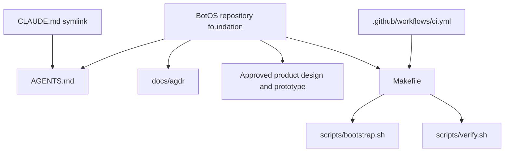

# Codebase Orientation

Where things live and what depends on what. Update this file in the same change
that adds or moves a top-level directory, or that changes implemented
dependencies or routes — an orientation doc that lags the tree is worse than
none.

This repository contains documentation and an approved standalone HTML
prototype. No BotOS application services, packages, database, host runtime, or
web routes exist yet. Architecture proposals belong in design documents until
they are implemented.

## Directory map

| Path | Purpose |
|------|---------|
| `docs/` | Project documentation |
| `docs/BUILD.md` | Current state, orientation, available checks |
| `docs/conventions.md` | Repository and development conventions |
| `docs/design/` | Approved product design, prototype, screenshots, provenance |
| `docs/agdr/` | Agent Decision Records (append-only; see `docs/agdr/README.md`) |
| `scripts/` | `bootstrap.sh` (toolchain check) and `verify.sh` (the gate) |
| `.github/` | CI workflow, PR template, issue templates |

## Foundation edges

CI deliberately shells out to the same `make verify` a developer runs, so the
two cannot drift apart.

## Component dependencies

| Component | State | Dependencies |
| --- | --- | --- |
| Agent instruction alias | Implemented symlink | Root `AGENTS.md` |
| Verify gate | Implemented | `make`, POSIX `sh`, `git`; optional `shellcheck` |
| Approved prototype | Documentation artifact | Browser; optional external font loading |
| Application services and packages | Not implemented | None declared |

## Surface to service map

| Surface | State | Service |
| --- | --- | --- |
| Prototype screens | Illustrative documentation | None |
| Production routes | Not implemented | None |

## Module dependency edges

None yet — there is no application code in this repository. When the first
application modules land, add the real graph here: one edge per line, source
module to the modules it imports. Call out any cycle explicitly rather than
letting it hide in the list.
