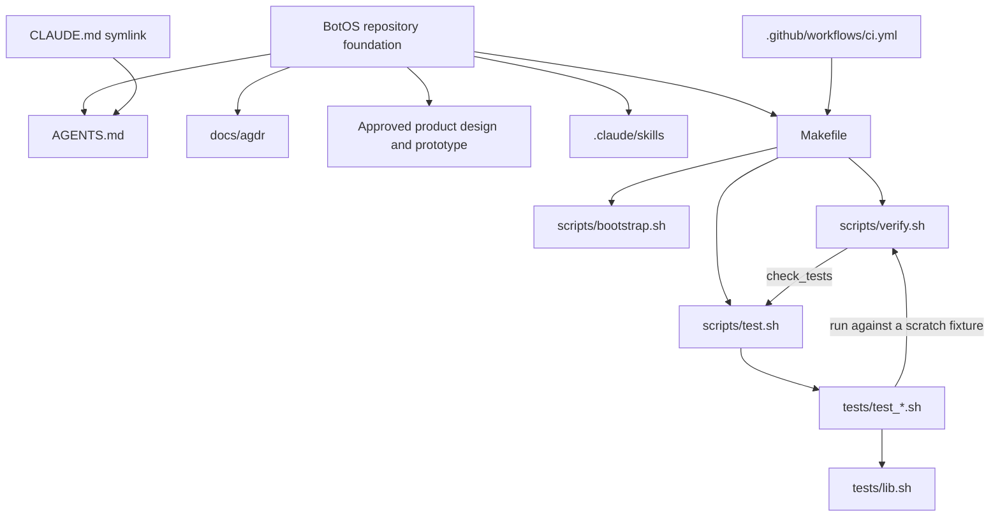

# Codebase Orientation

Where things live and what depends on what. Update this file in the same change
that adds or moves a top-level directory, or that changes implemented
dependencies or routes — an orientation doc that lags the tree is worse than
none.

This repository contains documentation and an approved standalone HTML
prototype. No BotOS application services, packages, database, host runtime, or
web routes exist yet. Architecture proposals belong in design documents until
they are implemented.

## Directory map

| Path | Purpose |
|------|---------|
| `docs/` | Project documentation |
| `docs/BUILD.md` | Current state, orientation, available checks |
| `docs/conventions.md` | Repository and development conventions |
| `docs/design/` | Approved product design, prototype, screenshots, provenance |
| `docs/agdr/` | Agent Decision Records (append-only; see `docs/agdr/README.md`) |
| `scripts/` | `bootstrap.sh` (toolchain check), `verify.sh` (the gate), `test.sh` (suite runner) |
| `tests/` | `lib.sh` (assertions + fixtures) and one `test_*.sh` per area under test |
| `.claude/skills/` | Repo skills: `verifying-changes`, `extending-the-verify-loop` |
| `.github/` | CI workflow, PR template, issue templates |

## Foundation edges

There is no application code in this repository, so these are the
foundation's own edges — the documents, the gate, and the suite that tests it.

CI deliberately shells out to the same `make verify` a developer runs, so the
two cannot drift apart.

**The one cycle, and why it is safe.** `scripts/verify.sh` runs the suite and
the suite runs `scripts/verify.sh`. It terminates because `scripts/test.sh`
exports `BOTOS_SKIP_TESTS=1`, which makes the nested gate runs skip
`check_tests`. Recursion depth is therefore exactly one. Removing that export
turns the gate into an infinite loop.

## Component dependencies

| Component | State | Dependencies |
| --- | --- | --- |
| Agent instruction alias | Implemented symlink | Root `AGENTS.md` |
| Verify gate | Implemented | `make`, POSIX `sh`, `git`; optional `shellcheck` |
| Test suite | Implemented | `make`, POSIX `sh`, `git`; runs the gate against scratch fixtures |
| Repo skills | Implemented docs | Harness skill loader; no runtime dependency |
| Approved prototype | Documentation artifact | Browser; optional external font loading |
| Application services and packages | Not implemented | None declared |

## Surface to service map

| Surface | State | Service |
| --- | --- | --- |
| Prototype screens | Illustrative documentation | None |
| Production routes | Not implemented | None |

## Module dependency edges

None yet — there is no application code in this repository. When the first
application modules land, add the real graph here: one edge per line, source
module to the modules it imports. Call out any cycle explicitly — the way the
foundation's own cycle is called out above — rather than letting it hide in
the list.
